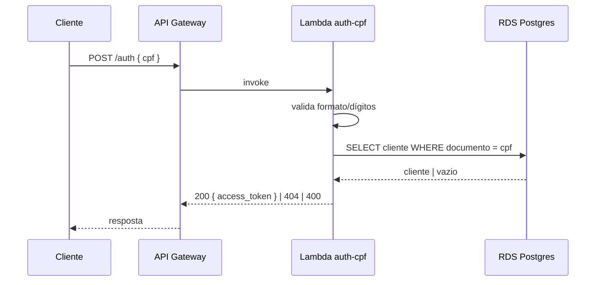

# tc-lambda-auth

Function serverless de autenticação por CPF do Tech Challenge (Fase 3 — FIAP).

**`POST /auth`** (via API Gateway): valida o CPF (formato + dígitos verificadores),
consulta a existência do cliente no RDS e devolve um **JWT HS256** (claims `sub`, `cpf`,
`scope: CLIENTE`, expiração 1h), aceito pelas rotas `/publico/*` da API. Inclui também o
**Lambda authorizer** que o API Gateway usa para validar esse token.

## Fluxo



## Stack

Node 20 + TypeScript · esbuild · Jest · pg · jsonwebtoken · Terraform (state próprio em S3)

## Esteira (CI/CD)

| Evento | Ação |
| --- | --- |
| Pull Request | lint + testes + build + `terraform plan` |
| Merge na `main` | build + `terraform apply` (deploy automático) |
| Botão Actions (workflow_dispatch) | `plan` \| `apply` \| `destroy` |

Autenticação via **OIDC** (role `gha-tc-lambda-auth`) — nenhum secret de AWS no repo.

**Pré-requisito de deploy:** stacks `tc-infra-kubernetes` e `tc-infra-database` aplicadas —
a Lambda roda na VPC (subnets privadas) e lê secrets/SG desses states via `terraform_remote_state`.

## Teste local

```bash
npm ci && npm test
```

## Repositórios relacionados

- [tech_challange_1](https://github.com/Os-Desacoplados-Pos-Tech-SOAP-FIAP/tech_challange_1) — aplicação NestJS
- [tc-infra-kubernetes](https://github.com/Os-Desacoplados-Pos-Tech-SOAP-FIAP/tc-infra-kubernetes) — VPC, EKS, ECR, API Gateway
- [tc-infra-database](https://github.com/Os-Desacoplados-Pos-Tech-SOAP-FIAP/tc-infra-database) — RDS + Secrets Manager
